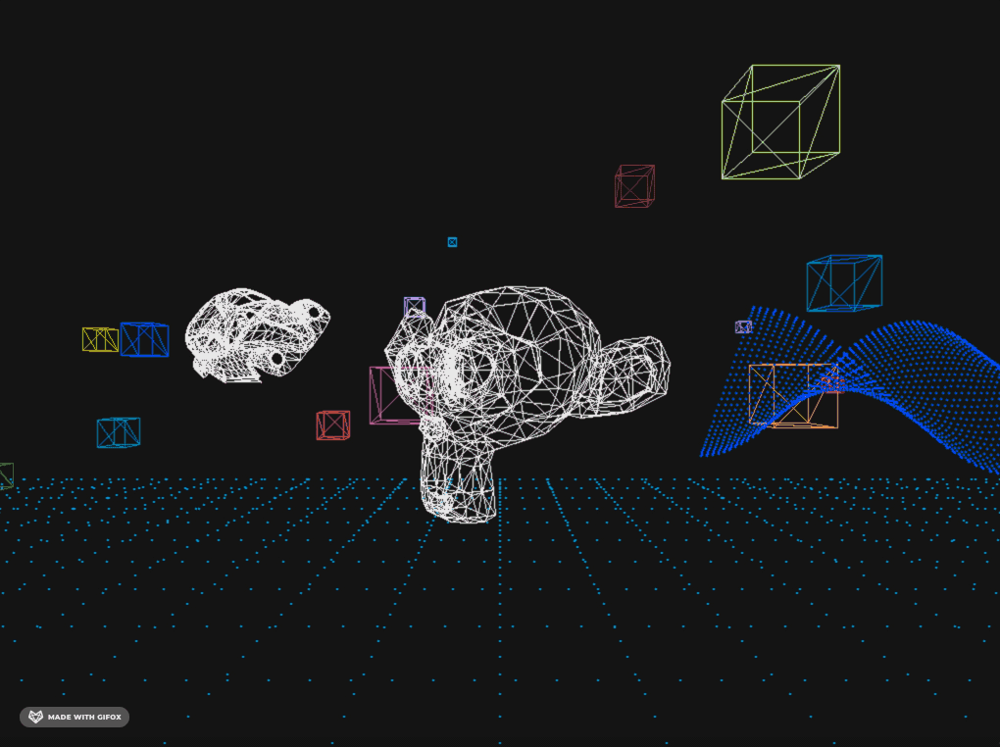

3D Playground - on Python from scratch.
=====================================



[](https://github.com/timabilov/python-play3d/actions/workflows/python-package.yml)
[](https://pypi.python.org/pypi/play3d/)
#### TL;DR: Basic 3D world playground with animations and [camera](#camera-keys-example) completely from scratch(only 2D pixels). 
This implementation / API only for demonstration and *playground* purposes based on [Perspective projection](https://en.wikipedia.org/wiki/3D_projection#Perspective_projection).     
Can be used on top of **any** 2d graphics engine/lib(frame buffers, sdl and etc.)

Not implemented features due to low performance:
* Face clipping not implemented, vertices clipping ignored too    
* Flat shading and Gouraud shading not implemented.
* Z-buffering 

`models.Model` API is open demonstration of [MVP](https://stackoverflow.com/questions/5550620/the-purpose-of-model-view-projection-matrix) model and is definitely a good starting point/topic for 3D graphics.

Also you can plot any function on 3D scene.


* [Install](#install)
* [How to use](#how-to-use)
* [Model View Projection](#model-view-projection)
  * [Projection](#projection)
  * [Camera](#world-camera)
    * [Camera scene example](#camera-keys-example)
* [Mesh and Wireframe](#mesh-and-wireframe)
* [Rasterization](#rasterization)
* [3D Plotting](#3d-plotting) 
* [Basic Wavefront .obj format support](#obj-format)
* [Model API](#models-api)
* [Trajectory API](#trajectory-api)
* [Pygame Example](#pygame-example)

## Install

```
pip install play3d
```

## How to use

There is only one requirement - to provide 2D pixel and line renderer(drawer)

As current example uses `pygame`,

```
pip install pygame==2.0.1 # recommended version
# You have to install sdl lib separately
# for Mac OS:
brew install sdl2 sdl2_gfx sdl2_image sdl2_mixer sdl2_net sdl2_ttf
```

```python
from play3d.three_d import Device
import pygame

# our adapter will rely on pygame renderer
put_pixel = lambda x, y, color: pygame.draw.circle(screen, color, (x, y), 1)
# we certainly can draw lines ourselves using put_pixel three_d.drawline
# but implementation below - much faster
line_adapter = lambda p1, p2, color: pygame.draw.line(screen, color, (p1[x], p1[y]), (p2[x], p2[y]), 1)

width, height = 1024, 768 # should be same as 2D provider 
Device.viewport(width, height)
Device.set_renderer(put_pixel, line_adapter)
screen = pygame.display.set_mode(Device.get_resolution())

```

That's all we need for setting up environment. 
Now we can create and render model objects by calling `Model.draw()` at each frame update (See [Example](#pygame-example))\
To create model you can simply pass 3D world vertices as 2-d list `Model(data=data)`

It is possible to provide faces as 2d array  `Model(data=data, faces=faces)`. Face index starts from 1.  Only triangles supported. For more information see below.

Simply by providing 3D (or 4D homogeneous where w=1) `data` vertices list - Model transforms this coordinates from 3D world space to projected screen space
```python
from play3d.models import Model

# our 2D library renderer setup.. See above.

# Cube model. Already built-in `models.Cube`  
cube = Model(position=(0, 0, 0),
                 data=[
                    [-1, 1, 1, 1],
                    [1, 1, 1, 1],
                    [-1, -1, 1, 1],
                    [1, -1, 1, 1],
                    [-1, 1, -1, 1],
                    [1, 1, -1, 1],
                    [1, -1, -1, 1],
                    [-1, -1, -1, 1]
                ])
while True: # your render lib/method
    cube.draw()
```
## Model View Projection

`models.Model` and `three_d.Camera` implements all MVP(See `Model.draw`).

### Projection

Here we use perspective projection matrix\
Z axis of clipped cube(from frustum) mapped to [-1, 1] and our camera directed to -z axis (OpenGL convention)\
Projection Matrix can be tuned there (aspect ratio, FOV and etc.) \
```python
Camera.near = 1
Camera.far = 10
Camera.fov = 60
Camera.aspect_ratio = 3/4
```


### World camera

By OpenGL standard we basically move our scene.
Facing direction considered when we move our camera in case of rotations(direction vector will be transformed too)\
Camera can be moved through `three_d.Camera` API:
```python
from play3d.three_d import Camera
camera = Camera.get_instance()

# move camera to x, y, z with 0.5 step considering facing direction
camera['x'] += 0.5
camera['y'] += 0.5
camera['z'] += 0.5

camera.move(0.5, 0.5, 0.5) # identical above

# rotate camera to our left on XZ plane
camera.rotate('y', 2) # 
```

#### Camera keys example


## Mesh and Wireframe

To exploit mesh one should provide both `data` and `faces`. Face represents triple group of vertices index referenced from `data`. Face index starts from 1.\
By default object rendered as wireframe
```python

from play3d.models import Model
triangle = Model(position=(-5, 3, -4),
                 data=[
                     [-3, 1, -7, 1],
                     [-2, 2, -7, 1],
                     [-1, 0, -7, 1],
                 ], faces=[[1, 2, 3]])
```


## Rasterization

By default if data and faces provided, rasterization will be enabled.\
For rasterization we use - standard slope algorithm with horizontal filling lines. 
```python
from play3d.models import Model

white = (230, 230, 230)
suzanne = Model.load_OBJ('suzanne.obj.txt', position=(-4, 2, -6), color=white, rasterize=True)
suzanne_wireframe = Model.load_OBJ('suzanne.obj.txt', position=(-4, 2, -6), color=white)
suzanne.rotate(0, -14)
suzanne_wireframe.rotate(0, 14)
```


## 3D plotting

You can plot any function you want by providing parametric equation as `func(*parameters) -> [x, y, z]`.
For example, sphere and some awesome wave both polar and parametric equations(Sphere built-in as `Models.Sphere`):
```python
import math
from play3d.models import Plot

def fn(phi, theta):

    return [
        math.sin(phi * math.pi / 180) * math.cos(theta * math.pi / 180),
        math.sin(theta * math.pi / 180) * math.sin(phi * math.pi / 180),
        math.cos(phi * math.pi / 180)
    ]

sphere_model = Plot(func=fn, allrange=[0, 360], position=(-4, 2, 1), color=(0, 64, 255))

blow_your_head = Plot(
    position=(-4, 2, 1), color=(0, 64, 255),
    func=lambda x, t: [x, math.cos(x) * math.cos(t), math.cos(t)], allrange=[0, 2*math.pi], interpolate=75
)

```


## OBJ format

Wawefront format is widely used as a standard in 3D graphics

You can import your model here. Only vertices and faces supported.\
`Model.load_OBJ(cls, path_or_url, wireframe=False, **all_model_kwargs)`

You can find examples here [github.com/alecjacobson/common-3d-test-models](https://github.com/alecjacobson/common-3d-test-models)

You might have to normalize(scale and etc.)each `.obj` sample differently \
Only vertices and faces are supported.

```python
Model.load_OBJ('beetle.obj.txt', wireframe=True, color=white, position=(-2, 2, -4), scale=3)
```


## Models API

`Models.Model`

| Fields | Description    |
| ------------- | ------------- |
| `position`  | `tuple=(0, 0, 0)` with x, y, z world coordinates  |
| `scale`  | `integer(=1)`  |
| `color`  | `tuple`  `(255, 255, 255)`   |
| `data`  | `list[[x, y, z, [w=1]]]` - Model vertices(points)  |
| `faces`  | `list[[A, B, C]]` - Defines triangles See: [Mesh and Wireframe](#mesh-and-wireframe)  |
| `rasterize`  | `bool(=True)` - Rasterize - "fill" an object  |
| `shimmering`  | `bool(=False)` - color flickering/dancing  |


```python
# Initial Model Matrix
model.matrix = Matrix([
                          [1 * scale, 0, 0, 0],
                          [0, 1 * scale, 0, 0],
                          [0, 0, 1 * scale, 0],
                          [*position, 1]
                      ])

```

### Methods
* `model_obj @ translate(x, y, z)`
  
  translates object's model matrix (in world space)

## Trajectory API

`Models.Trajectory`

| Fields | Description    |
| ------------- | ------------- |
| `func`  | `func` Parametrized math function which takes `*args` and returns world respective coordinates `tuple=(x, y, z)`    |

To move our object through defined path we can build Trajectory for our object. 
You can provide any parametric equation with args.\
World coordinates defined by `func(*args)` tuple output.  


### Methods
* `rotate(self, angle_x, angle_y=0, angle_z=0)`
  
  Rotates object relative to particular axis plane. First object translated from the world space back to local origin, then we rotate the object

* `route(self, trajectory: 'Trajectory', enable_trace=False)` 
  
  Set the function-based  trajectory routing for the object.

  - trajectory `Trajectory` - trajectory state
  - enable_trace `bool` - Keep track of i.e. draw trajectory path (breadcrumbs)

#### Example
```python
import math

from play3d.models import Sphere, Trajectory
white = (230, 230, 230)
moving_sphere = Sphere(position=(1, 3, -5), color=white, interpolate=50)
moving_sphere.route(Trajectory.ToAxis.Z(speed=0.02).backwards())

whirling_sphere = Sphere(position=(1, 3, -5), color=white, interpolate=50)
# Already built-in as Trajectory.SineXY(speed=0.1)
whirling_sphere.route(Trajectory(lambda x: [x, math.sin(x)], speed=0.1))


while True: # inside your "render()"
    moving_sphere.draw()
    whirling_sphere.draw()
```
## Pygame example

```python
import logging
import sys

import pygame

from play3d.models import Model, Grid
from pygame_utils import handle_camera_with_keys # custom keyboard handling - moving camera 
from play3d.three_d import Device, Camera
from play3d.utils import capture_fps

logging.basicConfig(stream=sys.stdout, level=logging.INFO)

black, white = (20, 20, 20), (230, 230, 230)


Device.viewport(1024, 768)
pygame.init()
screen = pygame.display.set_mode(Device.get_resolution())

# just for simplicity - array access, we should avoid that
x, y, z = 0, 1, 2

# pygame sdl line is faster than default one
line_adapter = lambda p1, p2, color: pygame.draw.line(screen, color, (p1[x], p1[y]), (p2[x], p2[y]), 1)
put_pixel = lambda x, y, color: pygame.draw.circle(screen, color, (x, y), 1)

Device.set_renderer(put_pixel, line_renderer=line_adapter)

grid = Grid(color=(30, 140, 200), dimensions=(30, 30))

# be aware of different scaling of .obj samples. Only vertices and faces supported! 
suzanne = Model.load_OBJ(
  'https://raw.githubusercontent.com/OpenGLInsights/OpenGLInsightsCode/master/Chapter%2026%20Indexing%20Multiple%20Vertex%20Arrays/article/suzanne.obj',
  position=(3, 2, -7), color=white, rasterize=True)
beetle = Model.load_OBJ(
  'https://raw.githubusercontent.com/alecjacobson/common-3d-test-models/master/data/beetle.obj',
   wireframe=False, color=white, position=(0, 2, -11), scale=3)
beetle.rotate(0, 45, 50)

camera = Camera.get_instance()
# move our camera up and back a bit, from origin
camera.move(y=1, z=2)


@capture_fps
def frame():
    if pygame.event.get(pygame.QUIT):
        sys.exit(0)

    screen.fill(black)
    handle_camera_with_keys()  # to move our camera - walk, can be ignored
    grid.draw()
    beetle.draw()
    suzanne.rotate(0, 1, 0).draw()
    pygame.display.flip()


while True:

    frame()
```
